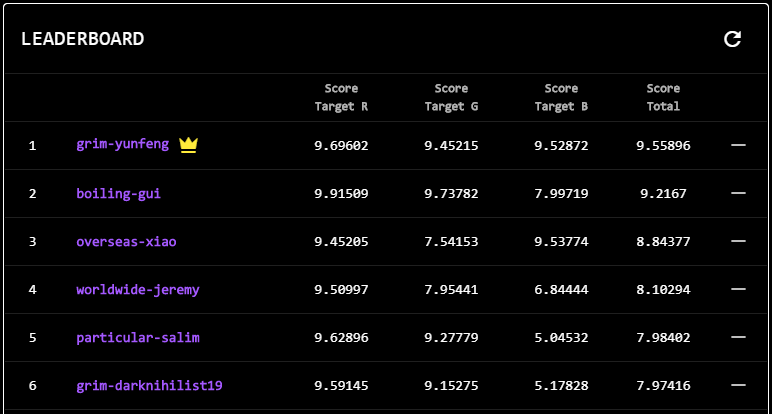

# DataCrunch Hackathon Round 3 Winning Solution

## Hackathon Link：
https://datacrunch.com/hackathon

## Running Env:
- Kaggle GPU
- Python 3.7

## Method:
- Feature Engineering: Aggregate by "Moons" column, and prepare features based on mean, std, deviation, etc.
- LightGBM
- CNN

## Thoughts
- I feel this hackathon is quite similar to a past Kaggle competition [Santander Customer Transaction Prediction](https://www.kaggle.com/c/santander-customer-transaction-prediction). Specifically, I got most ideas from [this link](https://www.kaggle.com/nawidsayed/lightgbm-and-cnn-3rd-place-solution) for the CNN idea.
- Since it is time series dataset, StratifiedKFold will not be appropriate.
- It's quite easy to overfitting.
- Although, I have won the first place for this hackathon, I feel like there still a long way to go to make the model stable (or useful). e.g. I changed number of CNN from 5 to 4, the LB score dropped drastically, and my lightgbm model just does not work at all for Target_1.